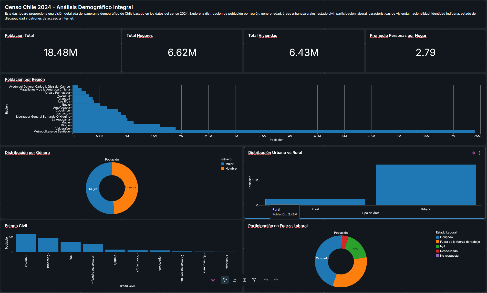

# Censo Chile 2024 — Análisis Demográfico en Databricks

Este proyecto procesa, integra y visualiza los microdatos del **Censo 2024 de Chile** utilizando Databricks Genie, transformando datos crudos con campos codificados en un dashboard interactivo que permite a tomadores de decisiones explorar la realidad demográfica del país y diseñar políticas públicas basadas en evidencia.

---

## 1. ¿Qué revelan los datos del Censo 2024?

### 1.1 Distribución Regional y Equilibrio Territorial

- La **población está altamente concentrada** en pocas regiones (Metropolitana, Valparaíso, Biobío). Esto evidencia un centralismo que sobrecarga la infraestructura urbana y deja regiones enteras con baja densidad poblacional y menor inversión en servicios.
- **Política pública posible:** Descentralizar incentivos tributarios y relocalizar servicios públicos para equilibrar el desarrollo territorial. Crear polos de desarrollo en regiones con baja densidad pero alto potencial económico (minería, energía, turismo, agricultura).

### 1.2 Brecha Urbano-Rural

- Una porción significativa de la población vive en zonas rurales con **menor acceso a salud, educación, conectividad y oportunidades laborales** en comparación con las zonas urbanas.
- **Política pública posible:** Inversión focalizada en conectividad vial, telecomunicaciones y salud rural. Programas de telemedicina y educación a distancia para cerrar la brecha de acceso. Incentivos para que profesionales se radiquen en zonas rurales.

### 1.3 Crisis Habitacional y Hacinamiento

- El **índice de hacinamiento** revela hogares donde viven más personas de las que la vivienda puede albergar dignamente. Es un indicador directo de déficit habitacional cualitativo.
- La **tenencia de vivienda** (propietarios, arrendatarios, allegados) muestra qué proporción de la población tiene acceso a vivienda propia y cuánta está en situación de precariedad.
- **Política pública posible:** Focalizar subsidios habitacionales en regiones con mayor hacinamiento. Programas de mejoramiento y ampliación de viviendas existentes. Regulación de arriendos en zonas con alta demanda. Planes de vivienda social en terrenos fiscales bien ubicados, cercanos a redes de transporte y servicios.

### 1.4 Brecha Digital

- El **acceso a internet fija, móvil y satelital** revela tres niveles de calidad de conexión. La internet fija (fibra/cable) es la de mayor velocidad y estabilidad, mientras que la satelital suele ser la más precaria y con mayor latencia.
- **Patrón esperado:** Zonas urbanas tienen internet fija; zonas rurales dependen de internet móvil o satelital. Algunas regiones pueden tener bajísima penetración de cualquier tipo de internet, lo que profundiza la exclusión.
- **Política pública posible:** Mapear zonas sin conectividad y priorizar inversión en infraestructura de telecomunicaciones (fibra óptica, torres 5G). Subsidios de internet para hogares de bajos ingresos. Programas de alfabetización digital en zonas con baja adopción tecnológica.

### 1.5 Participación Laboral y Desarrollo Económico

- La **fuerza laboral** (ocupados, desocupados, inactivos) cruzada por género, región y edad entrega una fotografía del mercado laboral chileno.
- **Brecha de género:** La participación femenina versus masculina revela desigualdades estructurales: las mujeres suelen tener menor participación por labores de cuidado no remunerado.
- **Juventud:** La proporción de jóvenes fuera del mercado laboral y del sistema educativo es crítica para políticas de empleo juvenil y capacitación.
- **Política pública posible:** Capacitación laboral focalizada en regiones con mayor desempleo. Incentivos a la contratación femenina (subsidios al empleo, salas cuna universales). Programas de reconversión laboral en zonas donde industrias tradicionales están en declive.

### 1.6 Composición Familiar y Envejecimiento

- El **estado civil** y el **tamaño del hogar** revelan cambios en la estructura familiar chilena: más hogares unipersonales, más adultos mayores viviendo solos, más familias monoparentales (mayoritariamente jefatura femenina).
- **Política pública posible:** Planificación de sistemas de cuidado para adultos mayores (centros diurnos, cuidadores domiciliarios). Políticas de vivienda para hogares pequeños y monoparentales. Rediseño de programas sociales que asumen una estructura familiar nuclear tradicional.

### 1.7 Inclusión de Pueblos Indígenas

- La **identidad indígena** por región muestra la distribución territorial de los pueblos originarios (Mapuche, Aymara, Rapa Nui, Diaguita, entre otros) y permite inferir sus condiciones de vida y acceso a servicios.
- **Política pública posible:** Políticas de desarrollo con enfoque intercultural. Consulta indígena para proyectos de inversión en territorios con alta concentración de pueblos originarios. Programas de educación bilingüe intercultural, salud con pertinencia cultural y fortalecimiento de economías locales.

### 1.8 Inclusión de Personas con Discapacidad

- La prevalencia de **discapacidad** por región y grupo etario permite dimensionar la magnitud de las necesidades de accesibilidad, salud y apoyo social.
- **Política pública posible:** Planificación de infraestructura accesible (transporte público, edificios gubernamentales, espacios urbanos). Programas de inclusión laboral con cuotas de contratación y adaptaciones en el puesto de trabajo. Fortalecimiento de la red de cuidados y rehabilitación comunitarios.

### 1.9 Migración e Internacionalización

- Las **nacionalidades** presentes revelan los flujos migratorios hacia Chile (venezolanos, haitianos, colombianos, peruanos, entre otros) y su distribución territorial, que tiende a concentrarse en la Región Metropolitana y en el norte del país.
- **Política pública posible:** Políticas de integración social y laboral para inmigrantes (homologación de títulos, acceso a capacitación). Planificación de servicios públicos (salud, educación) en zonas con alta concentración de población migrante. Programas de regularización migratoria con enfoque de derechos humanos.

---

## 2. ¿Cómo se construyó la solución?

### Fase 1: Integración y decodificación de datos brutos del censo

- **Problema original:** Los microdatos del censo están compuestos por tablas separadas (personas, hogares, viviendas) con campos codificados numéricamente. Por ejemplo, `sexo=1` debe transformarse en `sexo_desc="Masculino"` para ser legible.
- **Solución:** Se diseñó un pipeline SQL que:
  1. Identifica todas las tablas de referencia disponibles (`codigos_*`, `codigos_territoriales_*`, `reference_*`)
  2. Realiza JOINs jerárquicos desde la tabla más granular (personas) hacia hogares y viviendas
  3. Decodifica cada campo usando subqueries optimizadas con filtros `WHERE` para reducir el overhead de JOINs en tablas grandes
  4. Aplica nomenclatura estándar: campo original + sufijo `_desc` o `_nombre` para el valor decodificado
  5. Genera un dataset único y listo para análisis mediante `CREATE TABLE AS SELECT`
- **Resultado:** Un dataset (`censo_2024_completo`) con todos los campos en formato legible, optimizado para consultas analíticas en Databricks.
- **Archivo asociado:** [`PROMPT_GENIE_SPACE.md`](./PROMPT_GENIE_SPACE.md) — prompt reutilizable para cualquier integración de datos censales con decodificación de códigos.

### Fase 2: Dashboard interactivo en Databricks Genie

- **Problema original:** Los datos integrados necesitan una interfaz visual para que tomadores de decisiones (ministros, intendentes, alcaldes, analistas) puedan explorarlos sin escribir SQL.
- **Solución:** Se construyó un dashboard Genie con:
  - **Metric view dataset v1.1:** 14 dimensiones con nombres en español y manejo de NULLs mediante `COALESCE(..., 'N/A')`, más 5 medidas agregadas (población total, población, total hogares, total viviendas, promedio de personas por hogar)
  - **13 widgets** en grilla de 12 columnas: 4 contadores con métricas clave, 5 gráficos de barras (horizontales y verticales), 4 gráficos de torta con etiquetas
  - **Tema unificado:** tipografía Inter, paleta de 16 colores profesionales, bordes redondeados de 8px, sombras sutiles, márgenes y paddings consistentes
  - **Localización completa en español:** títulos de widgets, nombres de ejes, etiquetas de medidas, nombres de dimensiones
- **Resultado:** Dashboard interactivo, compartible y actualizable automáticamente con nuevos datos. Exportado como archivo `.lvdash.json` listo para importar.
- **Archivo asociado:** [`PROMPT_DASHBOARD.md`](./PROMPT_DASHBOARD.md) — prompt reutilizable para construir dashboards Genie con métricas, dimensiones, widgets y tema.
- **Archivo del dashboard:** [`Censo Chile 2024 - Análisis Demográfico.lvdash.json`](./Censo%20Chile%202024%20-%20An%C3%A1lisis%20Demogr%C3%A1fico.lvdash.json) — importable directamente a Databricks Genie.

---

## 3. Limitaciones y cómo se puede mejorar

### Análisis actual

- **Corte transversal:** Solo muestra el estado actual del censo 2024. No permite ver tendencias históricas ni evolución de indicadores.
- **Sin cruce con variables económicas:** No hay datos de ingresos, nivel educativo o salud para enriquecer los perfiles demográficos.
- **Sin componente geoespacial:** Los datos están a nivel de región, pero no hay mapas coropléticos ni análisis de proximidad a servicios.
- **Sin filtros interactivos:** El dashboard no permite segmentar por región o comuna dinámicamente.

### Mejoras propuestas

| Mejora                                                      | Impacto esperado                                                                                                                  |
| ----------------------------------------------------------- | --------------------------------------------------------------------------------------------------------------------------------- |
| **Comparación inter-censal** (2017 vs 2024)                 | Identificar tendencias de envejecimiento, migración interna, cambios en estructura familiar y distribución territorial            |
| **Cruce con encuesta CASEN**                                | Incorporar ingresos y pobreza multidimensional para análisis de desigualdad económica y segregación                               |
| **Mapas geoespaciales** a nivel de comuna o distrito censal | Visualizar brechas a nivel territorial fino para focalizar inversión con precisión quirúrgica                                     |
| **Segmentación por quintiles de ingreso**                   | Entender cómo varían hacinamiento, acceso a internet y tenencia de vivienda según nivel socioeconómico                            |
| **Filtros interactivos** por región, género, grupo etario   | Que cada tomador de decisiones pueda consultar su territorio y población de interés específicos                                   |
| **Alertas automáticas** en el dashboard                     | Notificar cuando indicadores críticos (hacinamiento severo, desempleo juvenil) superen umbrales definidos                         |
| **Modelos predictivos**                                     | Proyectar demanda de vivienda, plazas escolares, camas hospitalarias y cupos en salas cuna por región al 2030                     |
| **Tablero ejecutivo** con filtros por región y comuna       | Que intendentes, gobernadores y alcaldes puedan consultar indicadores de su territorio específico y compararse con otras regiones |

---

## 4. ¿Qué decisiones concretas permite tomar?

| Dimensión analizada                         | Decisión habilitada                                                                                                      |
| ------------------------------------------- | ------------------------------------------------------------------------------------------------------------------------ |
| Distribución poblacional por región         | Asignación de presupuesto regional y localización de nuevos hospitales, escuelas y centros de salud                      |
| Brecha urbano-rural                         | Focalización de inversión en conectividad vial, telecomunicaciones y servicios públicos en zonas rurales                 |
| Hacinamiento por región                     | Priorización de subsidios habitacionales y planes de vivienda social en las regiones más críticas                        |
| Tenencia de vivienda                        | Políticas de crédito hipotecario para primer hogar, regulación de arriendos, programas de vivienda social                |
| Brecha digital (fija vs móvil vs satelital) | Plan nacional de conectividad, subsidios de Internet para hogares vulnerables, programa de alfabetización digital        |
| Participación laboral por género y edad     | Programas de inserción laboral femenina, salas cuna universales, becas de capacitación para jóvenes                      |
| Identidad indígena por región               | Políticas de desarrollo intercultural, consulta indígena para proyectos territoriales, educación bilingüe                |
| Discapacidad por grupo etario               | Plan de accesibilidad universal en transporte y espacios públicos, red nacional de cuidados, cuotas de inclusión laboral |
| Nacionalidad y distribución migratoria      | Políticas de integración social y laboral, planificación de salud y educación en zonas receptoras                        |
| Estado civil y tamaño del hogar             | Programas para adultos mayores que viven solos, apoyo a familias monoparentales, rediseño de programas sociales          |
| Edad y estructura etaria                    | Planificación de largo plazo del sistema de pensiones, salud geriátrica, infraestructura escolar y universitaria         |

---

## 5. Archivos del proyecto

- **[`PROMPT_DASHBOARD.md`](./PROMPT_DASHBOARD.md)** — Prompt para construir el dashboard Genie con métricas, dimensiones, widgets y tema. Reutilizable para visualizar cualquier dataset censal o demográfico en Databricks.
- **[`PROMPT_GENIE_SPACE.md`](./PROMPT_GENIE_SPACE.md)** — Prompt para integrar tablas relacionadas y decodificar campos codificados. Reutilizable para cualquier proceso ETL de datos censales, encuestas o bases administrativas con tablas de código.
- **[`Censo Chile 2024 - Análisis Demográfico.lvdash.json`](./Censo%20Chile%202024%20-%20An%C3%A1lisis%20Demogr%C3%A1fico.lvdash.json)** — Dashboard exportado desde Databricks Genie, listo para importar directamente. Contiene la definición completa del metric view (dimensiones, medidas) y los 13 widgets con sus posiciones y configuraciones.

---

## 6. Cómo reutilizar este proyecto

1. **Para nuevos censos o encuestas:** Usar [`PROMPT_GENIE_SPACE.md`](./PROMPT_GENIE_SPACE.md) como guía para integrar y decodificar los microdatos, adaptando las tablas de código y las relaciones entre tablas según la estructura del nuevo dataset.
2. **Para construir dashboards similares:** Usar [`PROMPT_DASHBOARD.md`](./PROMPT_DASHBOARD.md) como plantilla, reemplazando dimensiones y medidas según el nuevo dataset. El prompt cubre metric views, widgets, tema y localización.
3. **Para importar a Databricks:** Subir el archivo [`Censo Chile 2024 - Análisis Demográfico.lvdash.json`](./Censo%20Chile%202024%20-%20An%C3%A1lisis%20Demogr%C3%A1fico.lvdash.json) a Genie a través de la opción "Import dashboard". Luego conectar o reemplazar el dataset de origen apuntando al correspondiente en Unity Catalog.
4. **Para adaptar a otro país o región:** Cambiar los nombres de regiones, dimensiones y medidas, traducir los títulos de widgets al idioma local y ajustar la paleta de colores si es necesario. La estructura del dashboard y el pipeline de integración son completamente agnósticos al territorio.

---

## 7. Pantallazo de ejemplo del Dashboard

---

## 8. Nota sobre el uso de inteligencia artificial

Este proyecto fue desarrollado con la asistencia de inteligencia artificial para agilizar el procesamiento, integración y visualización de los datos del Censo 2024. Si bien se ha puesto especial cuidado en la calidad y precisión del análisis, **todos los datos, visualizaciones y conclusiones deben ser revisados y validados por especialistas humanos antes de ser utilizados para la toma de decisiones de política pública**. La IA es una herramienta de apoyo, no un reemplazo del juicio experto, el conocimiento del contexto local y la validación estadística rigurosa.
